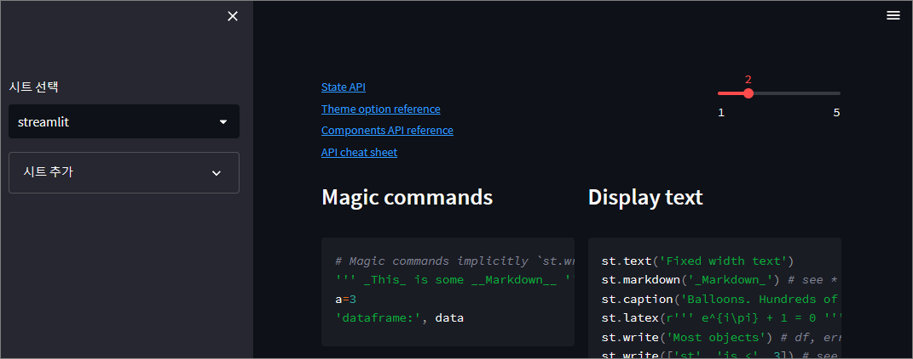

# Cheat-sheet-webapp

https://github.com/emfprhs119/cheat-sheet-webapp

streamlit framework 를 사용한 치트시트 웹앱

### 제공되는 기능은 다음과 같습니다.

- 파일시스템(json)을 사용한 치트시트 목록
- 치트시트 생성
- 치트시트 view column 변경
- 치트시트에 코드 추가
- json 편집

# How to run:

1. pip install streamlit
2. streamlit run app.py

# Requirements

A clean venv with just pip and then Streamlit

# Screenshot

# Reference

- streamlit-cheat-sheet : [https://github.com/daniellewisDL/streamlit-cheat-sheet](https://github.com/daniellewisDL/streamlit-cheat-sheet)
